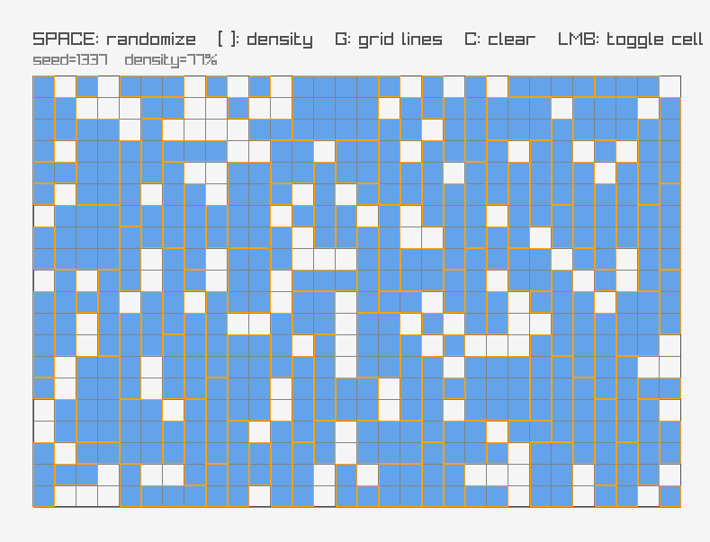
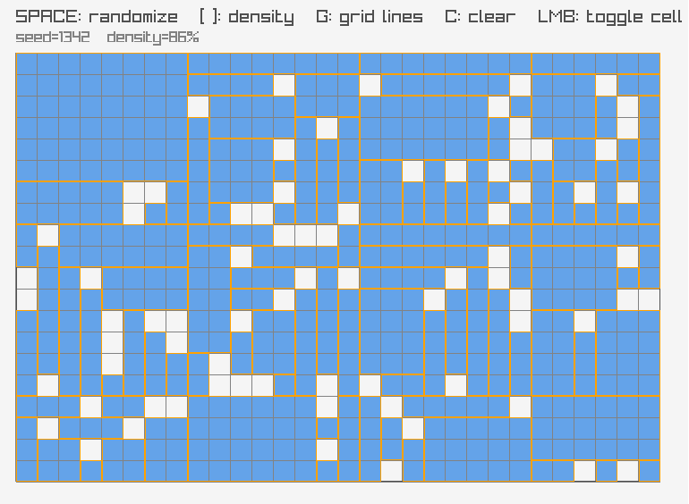
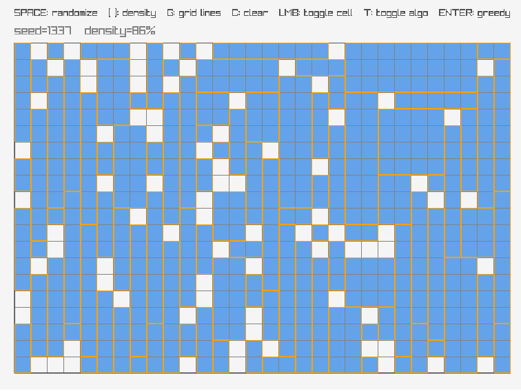
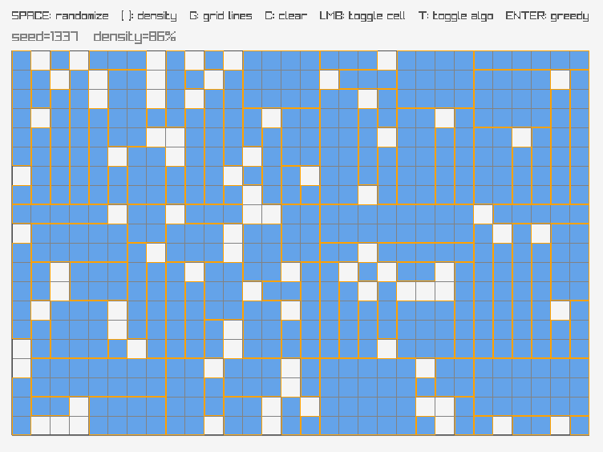

# navgrid-decomposer

A tiny 2D grid sandbox for navmesh-ish decomposition experiments.

This is part of a series of algorithms I prepared to demonstrate some popular game algorithms to a friend group.

One of the important things that keeps coming up in game dev multiple times is this: Group cells together for efficieny.

Wait, if we are combining cells, then why is the repo called decomp you ask?

There are multiple ways of doing this:
1) Greedily group the cells
2) Sub-division of space into a coarse uniform grid and then decompose it, if required

The second one can actually result in more 'cleaner' looking results.
Since, it preserves the sub-division grid structure somewhat, producing more 'square/rectangle' outputs. (See images below).

This contains both algorithms:
- Interactive grid viewer (raylib)
- Random fill and click-to-toggle cells
- **Greedy rectangle combination**: combine occupied cells into non-overlapping axis-aligned rectangles
- **Tiled decomposition**: split the grid into coarse uniform tiles and decompose per-tile

## Demo
1) Greedy combination algorithm:  

2) Tiled decomposition algorithm:  

3) Side by side comparison of both algorithms:

  
  

## Controls

- `LMB` : toggle a cell
- `SPACE` : randomize grid (same seed -> stable pattern, seed increments)
- `[` / `]` : decrease / increase fill density
- `C` : clear grid
- `G` : toggle grid lines
- `ENTER` : toggle rectangle overlay (recompute on enable)

You can also switch between the greedy and tiled algorithms:
- `T` : toggle tiled mode
- `-` / `=` : decrease / increase `tile_size`

## Build (CMake)

This project uses **CMake + FetchContent** to pull raylib.
